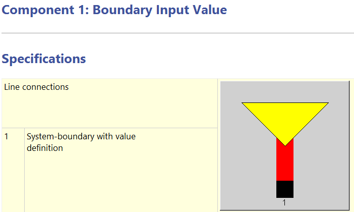
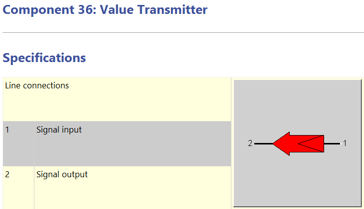
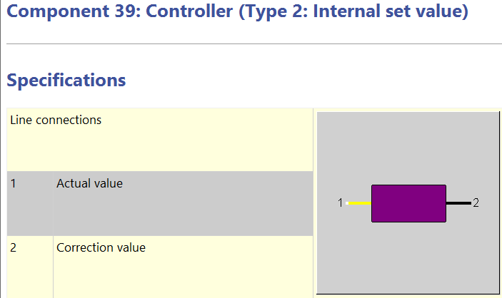
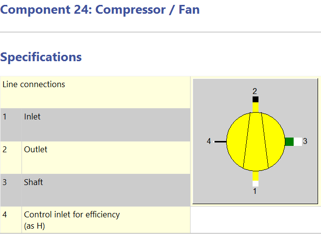
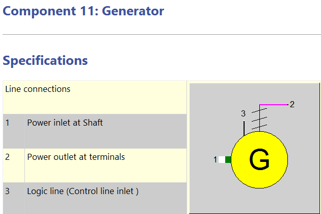
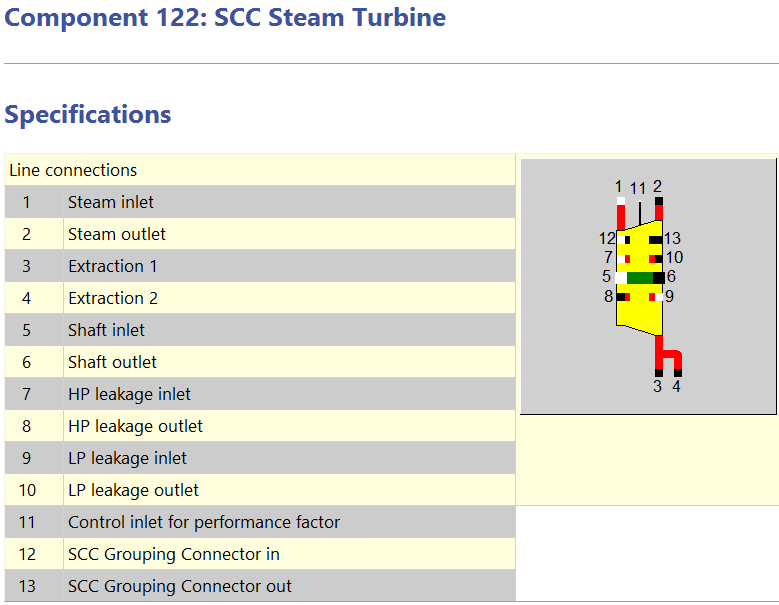
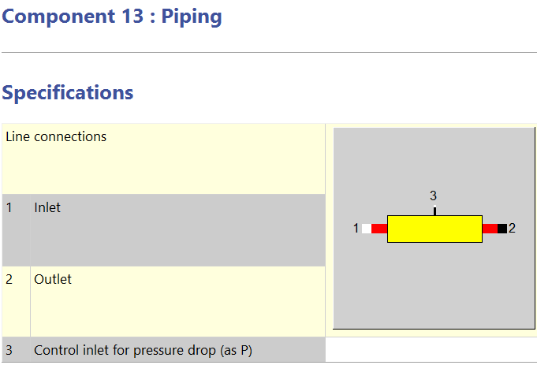
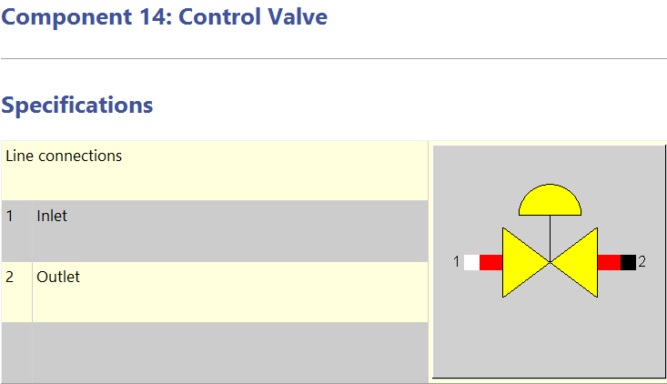

# 1.组件

## 1.1 值的设置

### 1. 边界值

  

  基本属性：P、T、M、H、Q + 组分；
  根据组分可自动计算低位热值，也可手动更改。

### 33. 初值

  

  基本属性：P、T、M、H、Q + 组分；
  与No.1性质完全相同，区别只在连接方式上（放在连线上）。

### 46. 测点

  

  与No.33类似的简化版，但只能设置一个属性的值。

### 36. 值传递

  

  将一个地方的值*（系数）传递到另一处。

### 39. 控制器

  

  调节2以控制1的值；
  FCHAR：偏离变大时，增大或减小1；
  Error初始值缺失：外置初值时放在1、2连点附近，中间不能间隔元件。

## 1.2 燃气轮机

### 24. 压缩机

需要给定出口压力，组件本身不计算出口压力；
只有一条特性曲线f（M/MN）。

### 94. 压缩机

有两个特性域，每个域15条特性曲线
特性域1：效率
特性域2：压增

### 22. 燃烧室

### 23. 燃气透平

必须给定进、出口压力。

### 11. 发电机

特性曲线有3条

## 1.3 蒸汽轮机

### 6. 蒸汽轮机

支持一切流体转化为机械能，用途最灵活；
四条特性曲线：效率、入口压力、出口压力、Stodola公式的误差修正系数；

不要用在冷凝器前一级，请采用122号组件

### 122. 蒸汽轮机

SCC是三个作者的名字；
增加了轴封漏汽的接口，漏汽量与压力由外部指定；
详细划分蒸汽轮机的5部分：入口、控制、bowl、透平、出口，考虑各部分影响

可设置出口焓损失

### 123. 轴封漏汽

### 7. 冷凝器

设计时，必须给定蒸汽温度。

## 1.4 换热元件

### 26. 省煤器/蒸发器/过热器

冷端不能是气体；
特性曲线2条：冷端M/MN、热端M/MN；
Off-design下KA=KAN*f1*f2。

### 61. 省煤器/蒸发器/过热器

支持冷端为气体；
采用指数EX12、EX34表达K的变化。

### 62. 双相换热器

采用指数表示K的变化。

### 43. 减温器

### 70. 汽包蒸发器

组件会依据吸热量自动计算输出蒸汽流量，注意过定义；
存在给定蒸汽流量计算K的非设计模式；
使用指数描述K。

## 1.5 管道

### 13. 管道

### 2. 节流阀

0流量时会警告：措施-局部非设计；
内部可设置压降，允许出口压力大于入口。

### 14. 控制阀

0流量不会警告；
出口压力只由外部给定，且出口压力不得大于入口。

### 8. 泵

简化的泵；
出口压力只由外部给定；
Simple mode外还能以水头作为计算特性（定速运行）。

### 18. 比例分流器

