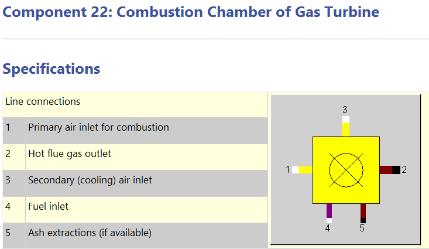
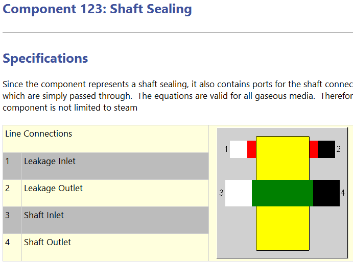
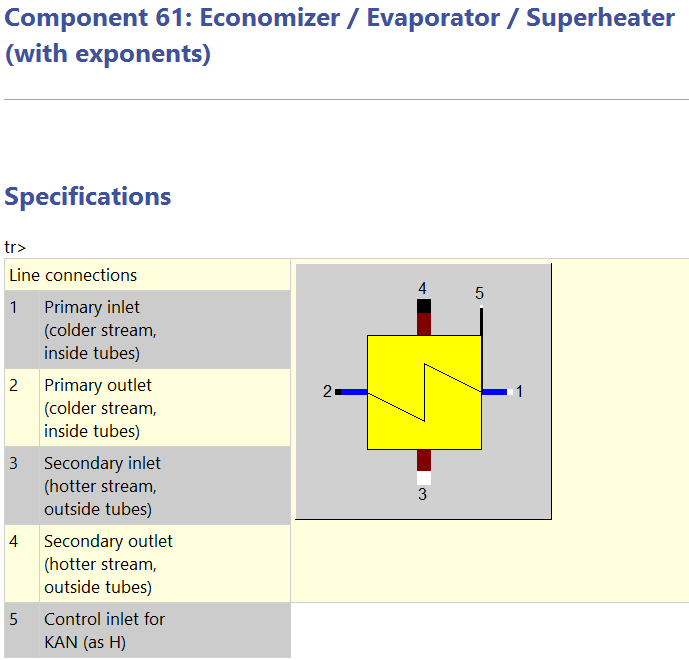

# 1. 功能介绍

## 1.1 EbsScript - 嵌入式编程

EbsScript是EBSILON专业内的嵌入式脚本语言（**PASCAL语言**），让您访问EBSILON的输入，输出和计算能力，并将这些与您自己的代码相结合，可以做到：

1.在dll或COM对象中执行自定义计算或调用自定义外部代码。
2.访问(读写)所有部件的所有计算参数，规格值，特性和结果值，所有管道和所有型材的结果。

使用场景：

1.主要的EbsScripts(例如，参数变化)
2.宏EbsScripts(模拟前后的操作)
3.内核脚本(用户定义的组件，在模拟中)
4.内核表达式(在模拟中求值)
5.文本字段
6.规范值表达式(在模拟前求值)

教程：

Help> Getting Started> Getting Started with EbsScript

Help> EbsScript

## 1.2 EbsOpen - 接口

EbsOpen是一个全面的COM类库，提供对EBSILON Professional中所有应用程序、模型、流和组件数据的访问。EbsOpen提供了超过200个类，3,500个方法和属性，可用于读取，运行，编辑和与EBSILON和EBSILON模型交互。它适用于将EBSILON Professional计算和数据与其它软件集成。

内部变量、函数、执行的名字：

Help>EbsOpen;

**安装位置>Data>Python>EbsOpen.py；**

Excel>Alt+F11>View>Object Browser>EbsOpen（需要按教程先配置）；

教程：

Help> Getting Started> Getting Started with EbsOpen

Help> EbsOpen

## 1.3 Validation

实测数据下，过定义模型的综合最小误差取值。

用Ebsilon计算电厂模型有两种选择:仿真和验证。在仿真模式中，指定的数值数量与解方程所需数量相匹配，因此有一个精确的解。通常在实际工厂中有更多的测量值，因此我们得到一个过定方程系统。众所周知，这里的测量值并不精确，而且受到一些不确定因素的影响。在验证模式中，使用统计方法来搜索过定方程系统的解，其中遵守组件方程(“约束”)，并且必须对测量值进行“尽可能少”的调整。这里的“尽可能少”是指最小化误差平方和。

## 1.4 Optimization

Calculation>Optimization：

设定变量范围，对目标值进行最小化/最大化寻优。当模型较为简单时，可直接用EbsScript实现。

## 1.5 EbsIdent

用于确认变量与其它变量的关系，一般用于组件的辨识，最多支持6系数的拟合。

## 1.6 Excel插件

教程：

[公众号-Ebsilon热力系统建模](https://mp.weixin.qq.com/s/qv_ZMWxG4Fs56-n0jYip6A)

## 1.7 Python调用

```
from win32com.client import Dispatch
import miniEbsOpen as Ebspy
# 调用对应版本EBSILON为COM对象的两种方式
app = Dispatch(Version) 
app = Ebspy.Dispatch(Version) 
```

pywin32为专门调用Windows系统API的库，在Ebspy中已经被引用。

Dispatch(dispatch)函数是win32com.client中的一个用于**调用COM对象**的方法。它通过传入的dispatch参数来创建一个格式为**dynamic.CDispatch对象**，在Ebspy中利用该函数创建了**IApplication对象**，该对象可以用于调用COM对象的方法和属性。

```
model = app.Open(MODELPATH)		# 运行COM对象的打开模型函数 
oc = app.ObjectCaster			# 命名COM对象的接口转化对象
```

名为app的IApplication对象中实际上并无Open、ObjectCaster的子类，但win32com.client中的__getattr__(self, attr: str)函数可以接受输入的参数，从而**动态创建任意值的dynamic.CDispatch子类**。

ObjectCaster 对象中含有所有组件的接口转化函数：ObjectCaster.CastToCompxx(组件名称)

```
Measuring_point_inAirT = oc.CastToComp46(model.Objects.Item('Measuring_point_inAirT'))
```

### pywin32：

该函数将对象静态转换为基接口，通过调用原对象的 _oleobj_属性的 InvokeTypes方法返回一个新对象，如果返回的对象不为空，则使用 Dispatch函数将其转换为指定的接口 Measuring_point_inAirT。

```
Measuring_point_inAirT.MEASM.Value = 25
```

随后可通过接口对组件的指定值进行幅值。

```
model.ActivateProfile(profile)			#采用"工况名"或编号激活工况
```

进行仿真：

```
model.ActivateProfile(profile)
print("Profile = " + model.ActiveProfile.Name)           # display name of active profile
  
calc_errors = model.CalculationErrors
  
start = time.time()
model.Simulate(calc_errors)                              # simulate the model
end = time.time()
  
print ("Simulation has " + str(calc_errors.Count) + " errors" + " in %f seconds" % (end - start))
```

1

### EbsOpen：

该函数形成的对象似乎只能用来输出，而不能幅值：

```
print(Measuring_point_inAirT.MEASM)
```

#### 工况操作

```
# profile = model.RootProfile.NewChild()    # 创建一个Iprofile对象作为子工况(无法命名)
# profile = model.RootProfile.NewChild().ChangeName("test_py")	#重命名？
# model.ActivateProfile("Design")           # 激活工况
# TCA = model.Objects.Item('Splitter_TCA')  # 依靠名称获取IObject对象
```

#### 组件操作

```
# TCA = model.Objects.Item('Splitter_TCA')  # 依靠名称获取IObject对象
# Splitter_TCA = oc.CastToComp18(model.Objects.Item('Splitter_TCA'))    # 将IObject转换为IComponent18对象
# value = Splitter_TCA.M3M1                         # 输出/赋值：得到的格式为IEbsValue
# Splitter_TCA_value = 0.95
# Splitter_TCA_value = value.value
```

#### 仿真

通过调用win32com中DispatchBaseClass类的 **\_ApplyTypes_()** 方法，进行COM对象内部功能的调用。

```
error2 = model2.CalculationErrors
result = model2.Simulate2(error2)
errorlist = [len(error2.WithSeverity(True,False,False)),
             len(error2.WithSeverity(False,True,False)),
             len(error2.WithSeverity(False,False,True))]

# simulate2()函数内部：
# e0 = model2._ApplyTypes_(1610743862, 1, (3, 0), ((16393, 50),), 'Simulate2', None,error2)[0]  # 仿真返回一个元组，第一个int元素表示结果类型
# e1 = model2._ApplyTypes_(1610743862, 1, (3, 0), ((16393, 50),), 'Simulate2', None,error2)[1]  # 第二个ICalculationError元素表示报错信息
# a = e1.Item(1)    # 获取报错的第1个错误信息,如何查看?
# a = e1.WithSeverity(True,True,True)   # 计数(错误，警告，建议)之和
```

12

#### 代码库修改

1. Simulate2：
   **维度超出：多一维**
   取第一维的仿真返回值即可。
   ```
   def Simulate2(self, CalculationErrors_out_only: ICalculationErrors=0) -> EpCalculationResultStatus2:
   		'returns new result enumeration which is consistent to the EbsScript simulate results'
   		return EpCalculationResultStatus2(self._ApplyTypes_(1610743862, 1, (3, 0), ((16393, 50),), 'Simulate2', None,CalculationErrors_out_only
   			)[0])
   ```
2. ICompxx：
   **赋值错误：无索引**
   将读值时采用的字典\_prop_map_get_{}中的相应属性的**端口ID**赋值到赋值字典\_prop_map_put_{}中，赋值后其余参数参考原有的格式即可。
   例如：
   ```
   _prop_map_get_{
   "M3M1": (1611137024, 2, (9, 0), (), "M3M1", '{B313724C-2097-4FC0-BF03-91449950EC28}'),
   }
   ------------>1611137024------------>
   _prop_map_put_{
   "M3M1":((1611137024, LCID, 4, 0),()),
   }
   ```

### 关键语句

#### 1.self.\_\_oleobj__.InvokeTypes()

win32com中的COM调用语句，oleobj是COM对象的代理对象，InvokeTypes是其的函数。

```
self._oleobj_.InvokeTypes(1610743821, LCID, 1, (9, 0), ((8195, 1),),ErrorClassifications)
```

12

#### 2.self.\_\_ApplyTypes__()

```
self._ApplyTypes_(1610743862, 1, (3, 0), ((16393, 50),), 'Simulate2', None,CalculationErrors_out_only)
```

12

#### 3.\_\_getattr__()

根据args=self.\_prop_map_get_.get(attr)查找名为attr的属性，用于读值。

#### 4.\_\_setattr__()

根据self.\_\_dict__[attr] =value对名为attr的属性进行赋值。

12

# 2. 组件

## 2.1 值的设置

### 1. 边界值

  

  基本属性：P、T、M、H、Q + 组分；
  根据组分可自动计算低位热值，也可手动更改。

### 33. 初值

  

  基本属性：P、T、M、H、Q + 组分；
  与No.1性质完全相同，区别只在连接方式上（放在连线上）。

### 46. 测点

  

  与No.33类似的简化版，但只能设置一个属性的值。

### 36. 值传递

  

  将一个地方的值*（系数）传递到另一处。

### 39. 控制器

  

  调节2以控制1的值；
  FCHAR：偏离变大时，增大或减小1；
  Error初始值缺失：外置初值时放在1、2连点附近，中间不能间隔元件。

### 80. 隔离器


隔离指定的特性：焓、压力、流量等，其它不受影响；

会计算隔离两端的差值，可设置差值多少时报警、报错；注意当收敛条件设置过大，出现结束仿真时的报错。

## 2.2 燃气轮机

### 24. 压缩机


需要给定出口压力，组件本身不计算出口压力；
只有一条特性曲线f（M/MN）。

### 94. 压缩机


有两个特性域，每个域15条特性曲线
特性域1：效率
特性域2：压增

### 22. 燃烧室



### 23. 燃气透平


必须给定进、出口压力。

### 106.燃气轮机

内置多厂商的设备特性曲线。

### 11. 发电机


特性曲线有3条

## 2.3 蒸汽轮机

### 6. 蒸汽轮机


支持一切流体转化为机械能，用途最灵活；
四条特性曲线：效率、入口压力、出口压力、Stodola公式的误差修正系数；

不要用在冷凝器前一级，请采用122号组件

### 122. 蒸汽轮机


SCC是三个作者的名字；
增加了轴封漏汽的接口，漏汽量与压力由外部指定；
详细划分蒸汽轮机的5部分：入口、控制、bowl、透平、出口，考虑各部分影响

可设置出口焓损失

### 123. 轴封漏汽



### 7. 冷凝器


设计时，必须给定蒸汽温度。

### 9. 除氧器


## 2.4 换热元件

### 26. 省煤器/蒸发器/过热器


冷端不能是气体；
特性曲线2条：冷端M/MN、热端M/MN；
Off-design下KA=KAN*f1*f2。

### 61. 省煤器/蒸发器/过热器



支持冷端为气体；

**计算模式（组件61、62、70统一）：**
没有特性曲线，采用基于流体特性（默认水&烟气）的对流换热系数AL12、AL34（教材中写作h）表达k的变化：AL12、AL34随质量流量的变化满足以EX13、EX34为指数的指数关系；

设计工况下LMTD法计算一次KN与AN的积KAN：端差->LMTD->Q/LMTD=KAN；

变工况下计算k*A，不单独计算各自的值。


### 62. 双相换热器


采用指数表示K的变化。

### 43. 减温器


### 70. 汽包蒸发器


组件会依据吸热量自动计算输出蒸汽流量，注意过定义；
存在给定蒸汽流量计算K的非设计模式；
使用指数描述K。

## 2.5 管道

### 13. 管道


### 2. 节流阀


0流量时会警告：措施-局部非设计；
内部可设置压降，允许出口压力大于入口。

### 14. 控制阀


0流量不会警告；
出口压力只由外部给定，且出口压力不得大于入口。

### 8. 泵


简化的泵；
出口压力只由外部给定；
等熵效率过低会影响出口温度；
Simple mode外还能以水头作为计算特性（定速运行）。

### 18. 比例分流器


### 161. 温度控制的注射器


控制器与注射器的结合；

注意起始值不要设为0；

## 2.6 工具

### 1. 文本

文本显示值：

{ 组件名 . 值名称 ; %.1f }，%.1f表示一位小数。如：{Electric_GT.Q;%.1f} kW

文本工具可进行简单计算：

{Electric_GT.Q*2+Electric_ST.Q;%.1f} kW

### 30. 差值计算器


3可拉出显示计算结果；

# 3. 建模仿真

## 3.1 设计工况

多个设计工况时，采取逻辑隔离软件，设置为大误差小警告。

对余热锅炉进行设计工况的建模；

有参考值的非设计工况，依据产商资料优先调节余热锅炉参数，同一工况下取消隔离后再调整其它模型；

先查质量平衡；

再查温度，注意蒸发器汽包的压力；

由于热平衡图缺失汽包压强，与蒸汽温度，所以蒸发器入口调节阀实际也为可调变量。
