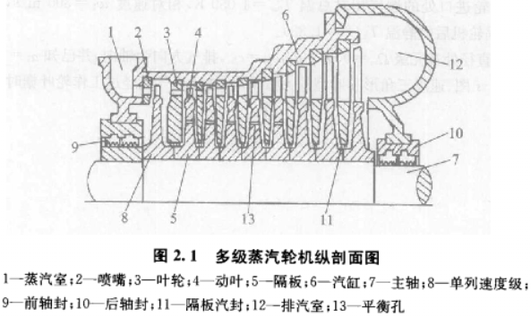

# 汽轮机

## 1. 入口

### 1.1 喷嘴配汽

#### 1.1.1 结构

* 全开自动**主汽阀1**、数个**调节阀门2**、每个2控制一组**喷嘴**：进汽流量通过2的开度、开启数量控制。
* 第一级叶片为调节级。

#### 1.1.2 特点

对比一般机组：

* 变负荷工况下节流损失小，因为使2开启数量尽量少，扩大开度；
* 设计工况下，由于喷嘴组间隙3（非全周进汽），导致面积减少，带来额外节流损失。

### 1.2节流配汽

#### 1.2.1 结构

一个调节阀、或多个开度相同的调节阀。

## 2. 叶片

### 2.1 冲动级、反动级

#### 2.1.1 结构

冲动级：动叶片出入口截面均衡，蒸汽只改变速度方向，利用冲击力做功。

反动级：动叶片通道逐渐缩小，蒸汽进一步膨胀，利用蒸汽离开的反作用力进一步做功。

#### 2.1.2 气流参数

冲动级：蒸汽在静叶栅（或叫喷嘴）中膨胀，P、T下降，速度增加；**动叶片中P、T、相对速度不变，绝对速度下降**。

反动级：蒸汽在静叶栅（或叫喷嘴）中膨胀，P、T下降，速度增加；**动叶片中P、T、绝对速度下降，相对速度上升**。

气流参数变化如图：

#### 2.1.3 特性

* 反动度
  定义为：**动叶片中蒸汽焓降/动、静叶片蒸汽总焓降。** 焓降转化为动能，代表膨胀程度。
  当反动度>0.4时才称为反动式。
* 冲动式汽轮机变负荷适应能力弱，反动式以西门子为代表，适应强。
* 效率曲线：

### 2.2 速度级、调节级

#### 2.2.1 结构

为了充分利用蒸汽余速，在一级叶轮上安装两级动叶栅，中间加装导向叶片。

#### 2.2.2 用途

作为单级汽轮机、汽轮机调节级

### 2.3 叶片冷却

## 3. 出口

## 4. 曲径轴封

### 4.1 结构

孔洞-气室-孔洞-气室……

### 4.2 气流参数

等焓过程：随着漏汽流动，每次经过孔洞的压力越来越低，速度越快，比焓下降越大。

### 4.3 轴封系统

#### 4.3.1 结构

* 高压轴封A6：A6部分蒸汽引到C5，一部分冷却中压转子，一部分泄漏至C4。
* 高压轴封A5：与高压缸气缸连通，高压防止A6高温蒸汽泄露。
* 高压轴封A2：引入**低温、略高于大气压**的蒸汽，一方面防止A3高温蒸汽向外泄露恶化润滑油，另一方面防止大气倒灌。
* 高压轴封A1：连接略低于大气压的蒸汽，A2的低温汽与漏进的空气一起吸出。

#### 4.3.2 漏汽利用

* 高压侧：加热**轴封加热器**的冷凝水；
* 低压侧：冷却高压轴封。

## 5. 能量损失

### 5.1 级内损失

#### （1）型阻损失

微观流动

#### （2）端部损失

微观流动

#### （3）喷嘴、动叶、余速

#### （4）叶高

#### （5）撞击

#### （6）扇形

#### （7）进汽

#### （8）湿汽

### 5.2 级外损失

进汽损失、排汽损失：流体速度越大，损失越大

## 6. 运行

### 6.1 滑压运行

汽轮机调节阀开度不变，只改变锅炉燃料、空气输入，从而调节进汽压力、流量，**进汽温度不变**。

1. 纯滑压
   调节阀全开，完全通过锅炉调节，调节慢。
2. 节流滑压
   调节阀半开，特殊情况下协助锅炉调节，长期节流损失。
3. 复合滑压
   结合**喷嘴配汽**与滑压、定压，全工况高热经济性，最常用。
