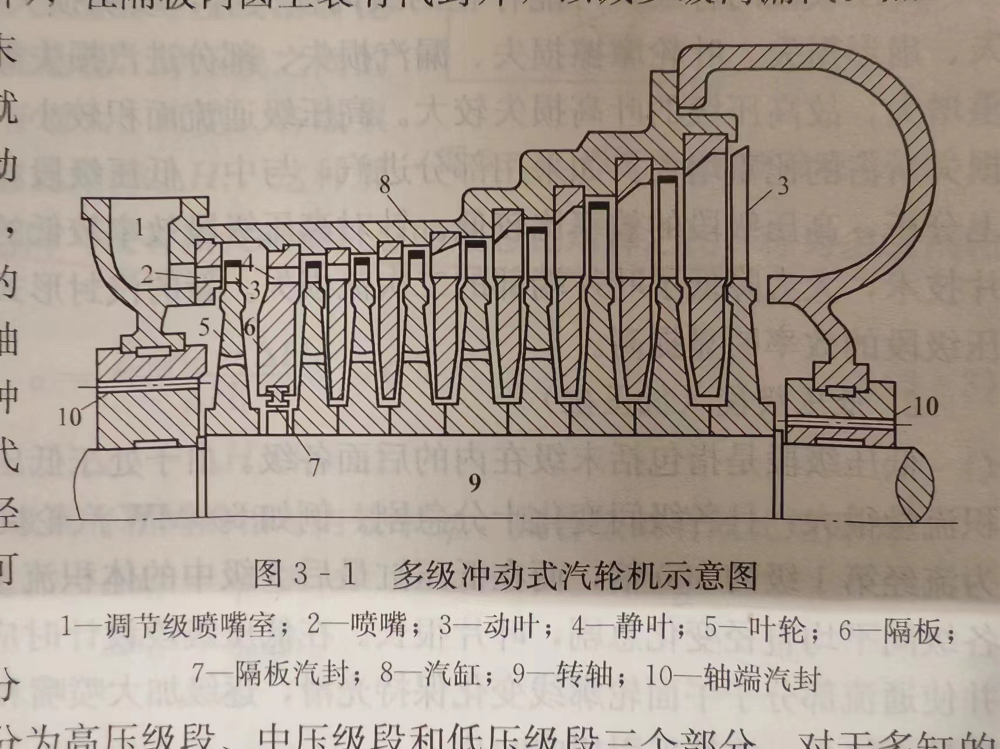
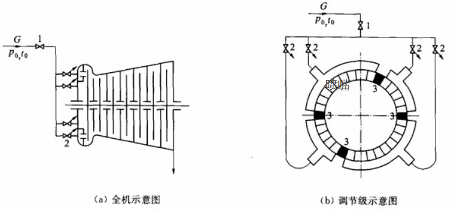
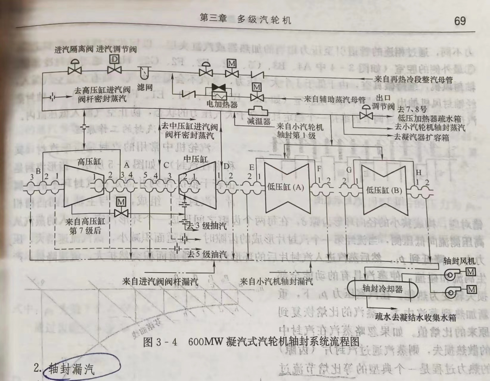
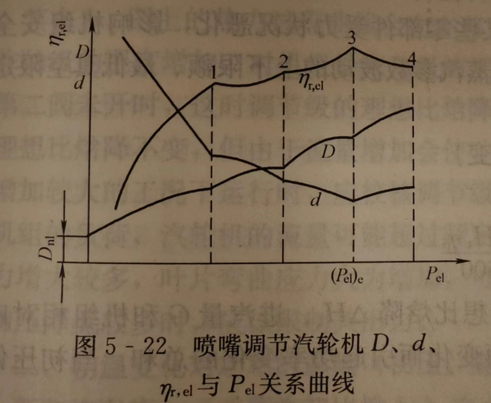
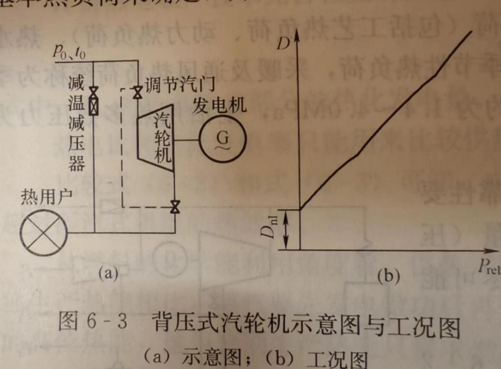
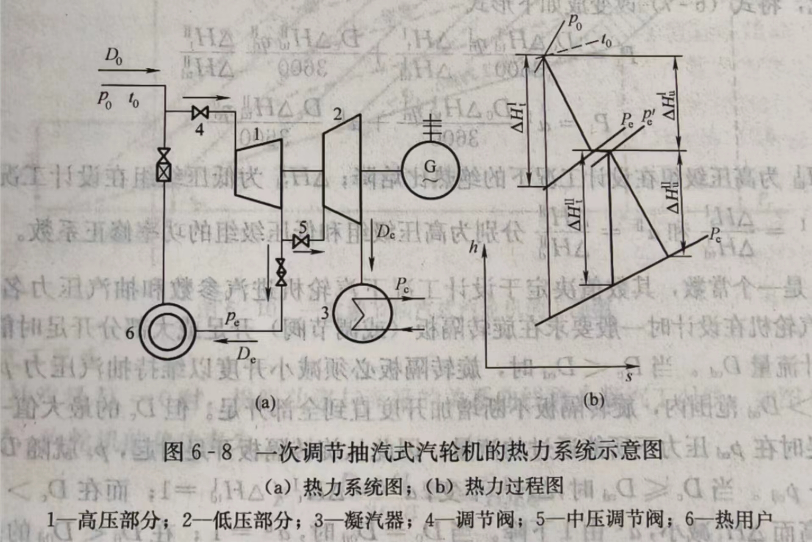
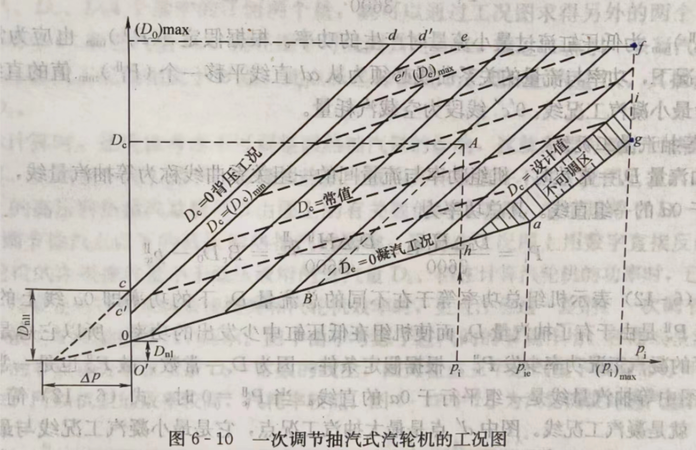
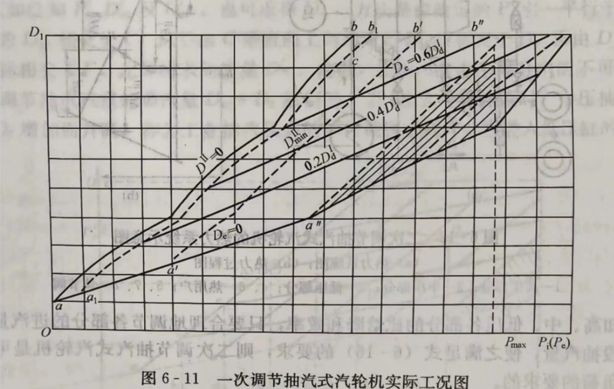
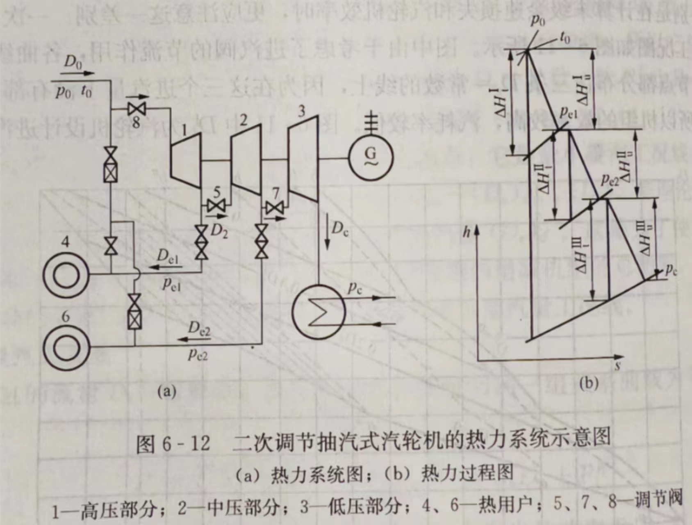

# 汽轮机分类

## 1.做功方式

冲动式：冲动原理，为提高效率具有一定反动度；

反动式：反动原理，常采用冲动原理的调节级；

## 2.热力过程

凝汽式（N）：排汽进入冷凝器；

背压式（B）：排汽用于供热，压力高于大气压；

一次、二次抽汽式（C、CC）：抽汽用于供热，排汽进入冷凝器；

抽背式（CB）：结合背压式与抽汽式；

## 3.进汽压力

低压：1.2-2MPa；

中压：2.1-4MPa；

高压：8.1-12.5MPa；

超高压：12.6-15MPa；

亚临界：15.1-22.5MPa；

超临界：>22.5MPa；（水的临界点：22MPa、373.95℃）

超超临界：>27MPa OR >600℃；

## 4.国内命名

种类&功率-进汽1参数/进汽2参数/进汽3参数（单位：MW、MPa、℃）

如：CC25-8.38/0.98/0.188-----25MW的二次抽汽汽轮机：进汽8.38MPa，一抽0.98MPa，二抽0.188MPa；

N300-16.7/538/538-----300MW的凝汽式汽轮机：进汽16.7MPa，538℃，再热蒸汽538℃。

# 汽轮机结构

多级冲动式

多级反动式

蒸汽比体积在低压区继续变大，从高压到低压区，叶片通道逐渐变宽。

## 1. 入口

### 1.1 喷嘴

- **减缩通道**：大型汽轮机实际运行中为渐缩结构，蒸汽流速小于声速，但可能在出口斜切处达到超声速；
- **渐扩通道**：超音速下需要渐扩才能膨胀；

### 1.2 喷嘴配汽

#### 1.2.1 结构

* 全开自动**主汽阀1（只有开、关状态）**、数个**调节阀门2（流量连续调节）**、每个2控制一组**喷嘴**：进汽流量通过2的开度、开启数量控制。
* 第一级叶片为调节级。

#### 1.2.2 特点

- **主流配汽方式**；
- 为了适配喷嘴配汽，大部分汽机都有**调节级**；

对比一般机组：

* 变负荷工况下节流损失小，因为使2开启数量尽量少，扩大开度；
* 设计工况下，由于喷嘴组间隙3（非全周进汽），导致面积减少，带来额外节流损失。

### 1.3节流配汽

#### 1.3.1 结构

一个调节阀、或多个开度相同的调节阀，本质上由一个阀门控制。

#### 1.3.2 特点

- 可以不需要调节级，第一级通常**全周进汽，适用弗留格尔公式**。
- 背压越高，节流损失越大，因此**不适合背压式**汽轮机。
- 低负荷下节流损失大，一般用于带基本负荷的机组。
- 变工况下各级的比焓降变化不大。

## 2. 叶片

### 2.1 叶栅形状：冲动级、反动级

#### 2.1.1 结构

冲动级：动叶片出入口截面对称均匀，蒸汽**只改变速度方向**，**前后基本无压差**，转轴的轴向受力小，利用冲击力做功。

- 压差小，可采用轻质、紧凑的**轮盘式转子**；
- 喷嘴在**隔板结构**的外环上；
- **反动度小，蒸汽动能损失大，效率较低；**

反动级：动叶片通道逐渐缩小，蒸汽进一步膨胀，利用蒸汽离开的反作用力进一步做功。

- 前后压差大，需要平衡活塞，转子采用**转鼓式结构**，没有叶轮；
- 喷嘴从**汽缸壁上**伸出；
- **反动度大，蒸汽动能损失小，效率较高**；
- 为减小级内损失，一般**全周进汽**；

#### 2.1.2 汽流参数（实际为黏性可压缩不稳定流动）

冲动级：蒸汽在静叶栅（或叫喷嘴）中膨胀，P、T下降，速度增加；**动叶片中P、T、相对速度不变，绝对速度下降**。蒸汽在动叶片中**仅仅改变速度方向**，产生的**冲动力做功**。

反动级：蒸汽在静叶栅（或叫喷嘴）中膨胀，P、T下降，速度增加；**动叶片中P、T、绝对速度下降，相对速度上升**。蒸汽在动叶片中会**继续膨胀**，因此在离开时**施加反动力**。

气流参数变化如图：

#### 2.1.3 特性

* 反动度
  定义为：**动叶片中蒸汽焓降/动、静叶片蒸汽总焓降。** 焓降转化为动能，代表膨胀程度。另外，级的反动度不是常数，随着**径向增大而增大**。
  当反动度>0.4时才称为反动式。
* 冲动式汽轮机变负荷适应能力弱，反动式以西门子为代表，适应强。
* 效率曲线：

### 2.2 进汽面积：调节级、压力级

#### 2.2.1 特点

- 调节级：**总是部分进汽、进汽面积可控、调节功率**；
- 压力（非调节）级：**可以全周进汽、进汽面积不变**；一般是**单列级**，可以冲动/反动；

### 2.3 叶栅数量：单列级、复列级

- 单列级：一个级中一列动叶栅；
- 复列级：一个级中多列动叶栅；

双列级：为了充分利用蒸汽余速，在一级叶轮上安装两级动叶栅，中间加装导向叶片。

### 2.4 叶片冷却

## 3. 出口凝汽器

凝汽器作用：冷却蒸汽、除氧、一定的储水能力。

蒸汽冷凝为水，比体积迅速降低，建立起高真空度。

抽气设备作用：抽出空气等不凝气体维持真空+机组启动时建立真空。

## 4. 曲径轴封

### 4.1 结构

孔洞-气室-孔洞-气室……

### 4.2 气流参数

等焓过程：随着漏汽流动，每次经过孔洞的压力越来越低，速度越快，比焓下降越大。

### 4.3 轴封系统

高压、中压缸漏汽会降低效率，污染厂房，低压缸漏汽会破坏凝汽器真空。

#### 4.3.1 轴封漏汽

* 高压轴封A6：A6部分蒸汽引到C5，一部分冷却中压转子，一部分泄漏至C4。
* 高压轴封A5：与高压缸气缸连通，高压防止A6高温蒸汽泄露。
* 高压轴封A2：引入**低温、略高于大气压**的蒸汽，一方面防止A3高温蒸汽向外泄露恶化润滑油，另一方面防止大气倒灌。
* 高压轴封A1：连接略低于大气压的蒸汽，A2的低温汽与漏进的空气一起吸出。

#### 4.3.2 轴封供汽

轴封系统的蒸汽来源一般为高、中压缸漏汽，在启动/低负荷阶段的蒸汽来源为辅助蒸汽母管/再热蒸汽冷端

#### 4.3.3 轴封回汽

最外端的蒸汽-空气混合物回到轴封加热器

#### 4.3.4 漏汽利用

* 高压侧：加热**轴封加热器**的冷凝水；
* 低压侧：冷却高压轴封。

## 5. 能量损失

### 5.1 级内损失

#### （1）型阻损失

附着层（边界层）微观流动

#### （2）端部损失

附着层（边界层）微观流动

#### （3）喷嘴、动叶、余速

喷嘴损失：蒸汽动能因摩擦等转化为热能，定义**速度系数**为喷嘴出口实际速度/理想速度，喷嘴**高度越高、宽度越窄**，损失越小。

动叶损失：定义**速度系数**为动叶栅出口实际速度/理想速度，**反动度越大**，损失越小。

余速损失：离开动叶栅的动能。

- 轮周效率：提高喷嘴、动叶的速度系数，降低喷嘴与动叶的出口角。

#### （4）叶高

#### （5）撞击

#### （6）扇形

#### （7）进汽

鼓风损失

斥汽损失

#### （8）湿汽

### 5.2 级外损失

进汽损失、排汽损失：流体速度越大，损失越大

## 6. 效率

### 6.1 相对效率

相对效率**不考虑循环**过程。

#### 6.1.1 汽轮机相对内效率

#### 6.1.2 机械效率

#### 6.1.3 发电机效率

#### 6.1.4 相对电效率

三者之积

### 6.2 绝对效率

绝对效率**考虑循环过程**，从蒸汽在锅炉的吸热开始考虑

#### 6.2.1 循环热效率

#### 6.2.2 绝对电效率

#### 6.2.3 电厂热效率

### 6.3 其它指标

#### 6.3.1 汽耗率

kg/(kWh)：只适合同蒸汽参数的机组比较

#### 6.3.2 热耗率

kJ/(kWh)：可用于不同机组的比较

## 7. 机组运行

### 7.1 定参数、滑参数

汽轮机功率主要影响因素：流量、理想比焓降。

#### 7.1.1 定参数运行

**改变流量**：蒸汽参数不变，调节阀门开度。

响应更快、低负荷下更加经济。

#### 7.1.2 滑参数/滑压运行

**改变理想比焓降**：汽轮机调节阀开度基本不变，只改变锅炉燃料、空气输入，从而调节进汽压力、流量，**进汽温度不变**。

主流运行方式，节流损失小，大部分情况下更经济。

1. 纯滑压
   调节阀全开，完全通过锅炉调节，调节慢。
2. 节流滑压
   调节阀半开，特殊情况下协助锅炉调节，长期节流损失。
3. 复合滑压
   结合**喷嘴配汽**与滑压、定压，全工况高热经济性，最常用。

### 7.2 变工况运行

#### 7.2.1 喷嘴流量-压力

横坐标：喷嘴后前压比，纵坐标：流量/最大流量；喷嘴前达到临界初压后继续增大，流量维持不变（左侧）。

#### 7.2.2 级的流量-压力

1. 弗留格尔公式条件

- 变工况时各级的流通面积不变，因此调节级不适用；
- 通过各级的流量相同；
- 机组“无穷级”，至少大于4、5级；

2. 凝汽式汽轮机调节级
   调节级后的压力与流量成正比。变工况下，比焓降与反动度均有变化。
   调节级开度对于相对内效率的影响：
   
3. 凝汽式汽轮机中间级
   无论末级是否临界，中间级的压力与流量成正比。但中间级的温度变化较大，需考虑实际修正。
4. 背压式汽轮机中间级
   一般末级达不到临界压力，但需要考虑背压，中间级的压力与流量成双曲线关系。

#### 7.2.3 功率影响因素

1. **初压**---初温、背压不变

- **初压过分增大**导致湿蒸汽区变大，末级工作条件恶化。
- **初压过分降低**需限制输出功率，防止为该功率的流量超标，冲击末级叶片。
- **阀门开度不变、流量改变**：功率变化-初压变化成正比，背压越大，斜率越大。

- **阀门开度改变、流量不变**：对于节流配汽而言，功率不变；对于喷嘴配汽，功率变化不大。

2.**初温**---初压、背压不变

- **初温升高**因机组材料约束而受严格限制；
- **初温降低**需限制功率与流量，保证机组机械强度安全；
- 锅炉处吸热量不变：初温每升高30-50℃，汽机内效率提高1%；
- 调节阀开度不变：
- 流量不变：

3.背压---初温、初压不变

背压升高主要影响末级的工况：负荷不变时，流量增大，需校核机械强度，排汽温度升高，低压缸膨胀偏心振动。

#### 7.2.4 变工况效率

1. 喷嘴调节的凝汽式汽轮机：效率降低在调节级、末级；
2. D-汽耗量、d-汽耗率、η-相对电效率：
   
3. 节流调节的凝汽式汽轮机：效率降低在节流损失、末级；
4. D-汽耗量、d-汽耗率、η-相对电效率：
   
5. 背压式汽轮机：效率降低在调节级、末几级。

## 8. 供热机组

### 8.1 背压机组

#### 8.1.1 结构

- **背压机组**：一级调节级+若干压力级，因为背压高、流量变化大，采用喷嘴配汽。
- **抽背机组**：额外的调节抽汽。
- **前置式汽轮机**：背压排汽进入后续的若干个低压机组发电。

  

#### 8.1.2 特点

- 相同蒸汽初参数下，理想比焓降小于凝汽式，因此**级数少**，**轻便简单**；
- 同功率下，进汽量大于凝汽式，各级叶片直径小；
- 蒸汽流量变化大，通常采用喷嘴配汽；
- 没有低压区，各级叶片相对均匀；

### 8.2 调节抽汽机组

#### 8.2.1 一次调节抽汽机组

高压机组部分排汽经过截止阀、逆止阀进入热网，其它排汽经过调节阀进入低压机组。

1. 理论工况图（假定流量-功率正比）

- 左-**纯背压cd**；一般需要至少5-10%的排汽带走低压机组鼓风热量，所以**最大背压c'd'；**
- 右-**最大设计凝汽ag**；**低压机组设计流量hi**；**发电机最大发电fg**；**抽汽压力不可调区**：低压机组流量变化反作用于抽汽压力；
- 上-**最大总进汽df**；**d'最大抽汽点**，留足余量的**最大抽汽线e'e**；
- 下-**纯凝oa**；
- **o'o**低压机组的空载汽耗量；**o'c**高压机组的空载汽耗量；
- 总进汽 $D_0$、低压缸排汽$D_c$、抽汽$D_e$、功率$P_i$---**知二求全**；

2. 实际工况图：回热抽汽、进汽阀节流。

#### 8.2.2 二次调节抽汽机组

1. 理论工况图
   
