# 燃气轮机

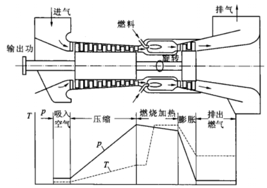

## 1.类型

### 1.1 等容燃烧开式循环

燃烧室中进行等压燃烧：等容燃烧结构复杂、效率低下，已经淘汰；

工质来自大气，排入大气：闭式循环设备笨重、效率低下，使用很少；

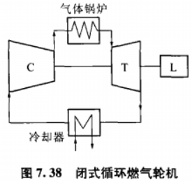

### 1.2 轴系

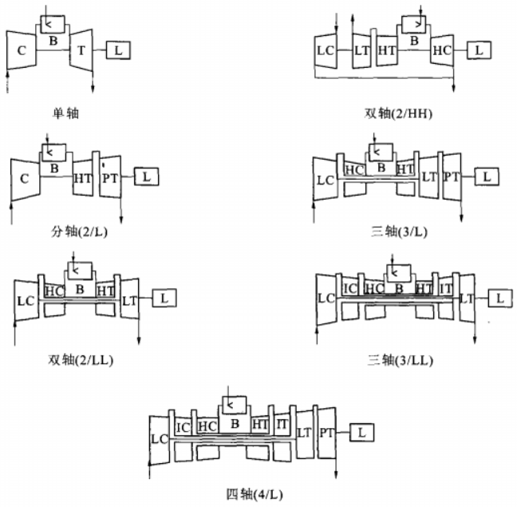

## 2. 热力循环

### 2.1 简单循环/Brayton循环

#### 2.1.1 理想条件

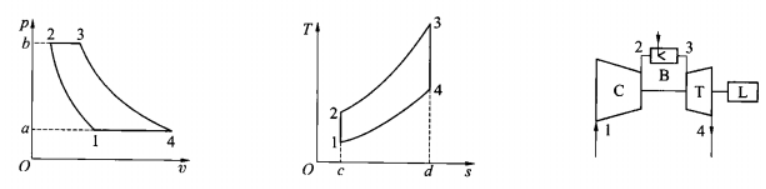

等熵压缩/膨胀 + 等压燃烧/大气条件

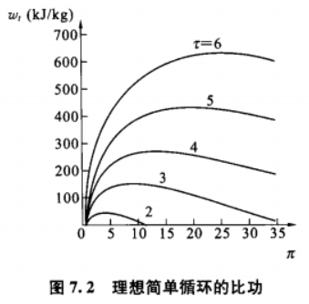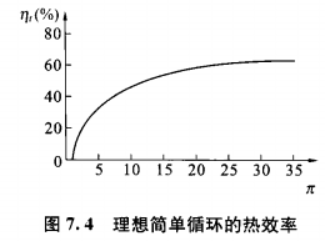

* π：压比-压气机出口/入口；
* τ：温比-最高温/最低温；

#### 2.1.2 实际条件

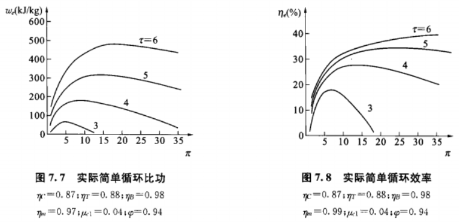

存在最佳压比；
  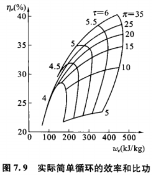

### 2.2 压气机、燃气轮机

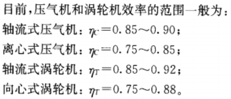

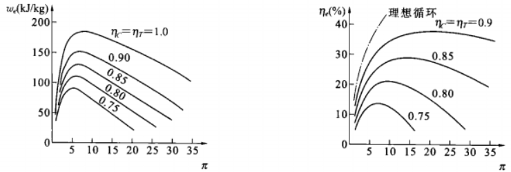

### 2.3 TCA流量

当燃气轮机叶片需要冷却时，需要从压气机抽取空气，加上密封等用途的抽气，可达**10-15%**。

* 冷却空气冷却一、二级叶片后，也会在燃气轮机里做功，可引入“等效流量”；
* 一方面，流量大，可采用更高温度，循环温比上升，效率提高；
* 另一方面，流量大，影响压气机效率，效率下降；

不能仅仅依靠增大流量来冷却叶片。

### 2.4 其它循环

#### 2.4.1 回热

#### 2.4.2 间冷

#### 2.4.3 再热

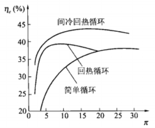

## 3.压气机

### 3.1 容积式-活塞式

### 3.2 动力式-轴流式

#### 3.2.1 结构

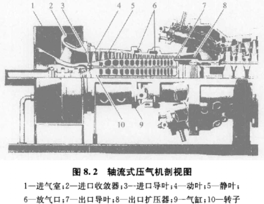

* 动叶：固定转子上，做功转化为气体速度、压力；
* 静叶：固定机壳上，截面扩大，气体动能转化为压力；
* 进口导叶：调整进入第一级动叶的气体流向，没有时进汽为轴向；
* 出口导叶/整流叶片：调整离开最后一级静叶的气体流向为轴向；
* 进口收敛器：加速气体；
* 出口扩压器：进一步加压；

#### 3.2.2 特性

* 单级压比低，1-2之间；
* 多级轴流式整体效率高84-89%；
* 适用于大型燃气轮机；

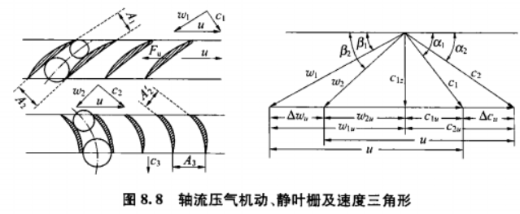

* 单级轴流式：压比π与效率η都和流量成抛物线关系（转速恒定）；

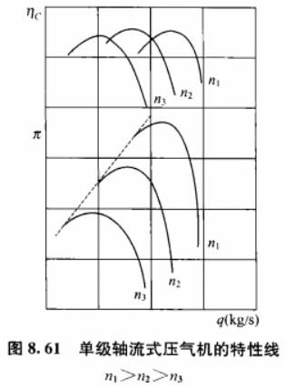

* 多级轴流式：流量变大使π、η下降明显；
* 多级轴流式：喘振边界切割左半侧的特性曲线；

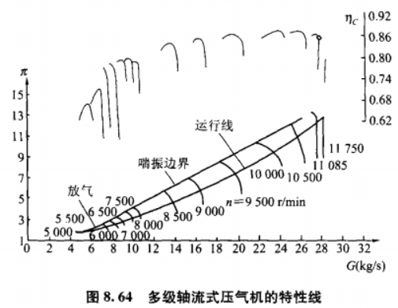

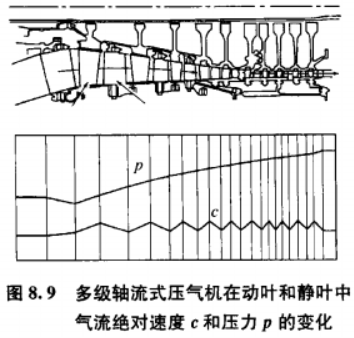

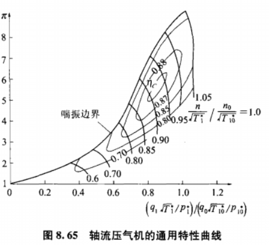

### 3.3 动力式-离心式

#### 3.3.1 结构

1. 导风轮

工作叶轮常常把导风轮（左侧弯曲前沿）与工作轮（右侧）加工到一起制成。

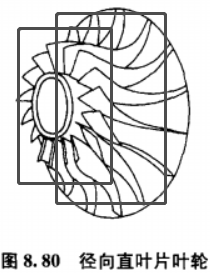

2. 工作轮

* 开式：气体直接摩擦机壳，损失最大；
* 闭式：气体只在轮内流动，损失最小，但强度要求高；
* 半开式：使用最广泛；

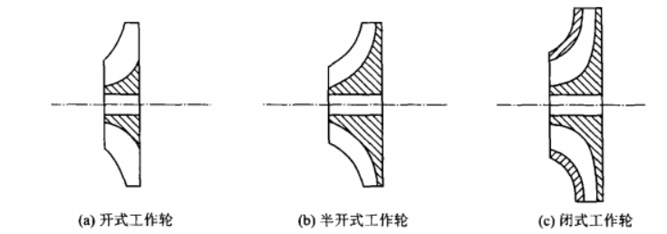

3. 扩压器

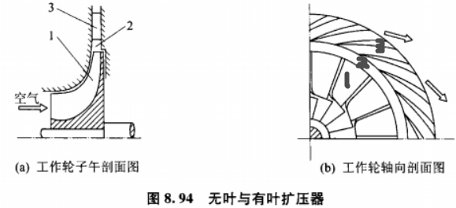

无叶扩压器-2

有叶扩压器-3

#### 3.3.2 特性

* 单级压比高，3-8；
* 整机效率低，75-82%；
* 适用于微型燃气轮机；
  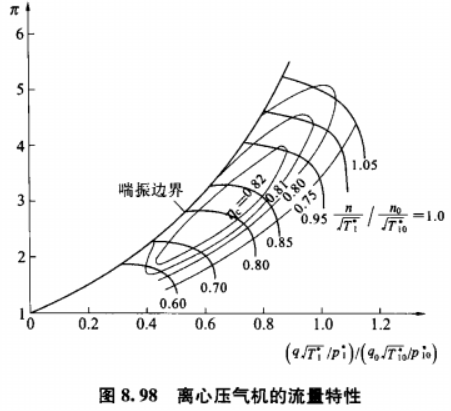

### 3.4 动力式-混合式

#### 3.4.1 结构

先轴流式，后离心式

#### 3.4.2 特性

适用于中小型燃气轮机；

## 4. 燃烧室

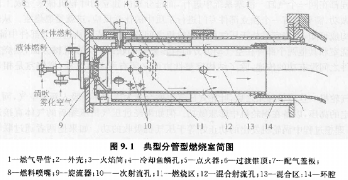

空气进口14：

分流-一次空气-9-7-6-10-11；燃烧

分流-二次空气-12；冷却烟气

分流-冷却空气-4；冷却燃烧室
