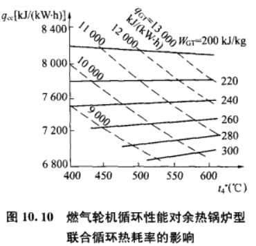
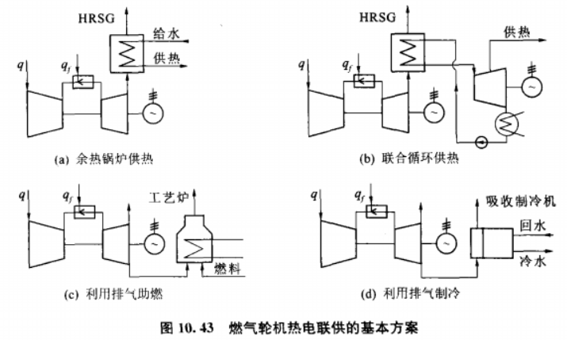

# 燃气蒸汽联合循环

## 1. 基本类型

### 1.1 余热锅炉型

改造方便，应用最广。

### 1.2 补燃型

烟道补燃：增加补燃室，投入燃料燃烧；

排气助燃：换为燃烧锅炉，在锅炉内燃烧；

效率略低一些，蒸汽温度方便调控，燃气轮机改造方案之一；

### 1.3 增压燃烧锅炉型

* 融合燃烧室、余热锅炉，压气机提高锅炉压力，锅炉密封；
* 燃气温度1100℃下效率高于余热锅炉，超过后迅速衰减；
* 安全隐患；
* 燃煤流化床改造方案之一；

### 1.4 加热锅炉给水型

* 加热的给水温度低，整体效率较低；
* 蒸汽轮机电站扩容方案之一；

### 1.5 锅炉并联型

* 余热锅炉并联常规锅炉；
* 改造后效率提升不大；

## 2. 整体热力性能

### 2.1 燃气轮机影响

### 2.2 蒸汽参数影响

热耗率-蒸汽初压，FW给水温度

### 2.3 余热锅炉影响

#### 2.3.1 单压力

* 节点温差${△t}_{p}$：烟气、水汽之间的最小温差;
* 露点：蒸汽凝结温度；
* 蒸汽压力回路：接近点温差${△t}_{a}$：为了防止省煤器中汽化而加压，导致蒸发温度上升；
* 单压锅炉平均传热温差大，损失大；

#### 2.3.2 多压力

* 有效降低烟气尾部余热；
* 双压使全系统效率提升2-3%；

### 2.4 效率提升

#### 2.4.1 变工况

余热锅炉型的汽轮机可以不采用调节级的**喷嘴配汽**，通过滑压运行来改变负荷，因此可以使用单控制阀的**节流配汽**，提高设计工况下的效率。

#### 2.4.2 余热锅炉

利用锅炉尾部省煤器预热给水；

利用锅炉给除氧器供汽，而非汽轮机抽汽；

采用多压的余热锅炉；

### 2.5 联合循环汽轮机

#### 2.5.1 对比常规汽轮机

常规汽轮机抽汽加热给水，低压缸向凝汽器流量为主蒸汽的70%；

联合循环汽轮机中不加热给水，不需要给水加热器，多压锅炉会使低压缸向凝汽器流量比主蒸汽大的30%；

在于燃气轮机共用一轴与发电机时要求快速启动；

采用滑压运行，全周进汽，不用调节级，效率高；

综上：**高效、快速启动、排汽量大、滑压运行**。

### 2.6 余热锅炉（HRSG：热回收蒸发器）

#### 2.6.1 循环方式

自然循环：美国使用多

强制循环：欧洲使用多，占地小，冷启动快一点；

#### 2.6.2 汽水结构

1. 自然、单压无再热：凝汽器承担了除氧功能。

2. 强制、双压

3. 自然、三压

## 3. 运行

### 3.1 启停

#### 3.1.1 启动类型

冷态启动：停机>72 h；

暖态启动：停机<24 h；

热态启动：停机<12 h；

#### 3.1.2 有无旁通烟囱

1. 无旁通

* 无旁通烟囱时，机组启动后．燃气轮机的排气全部通过余热锅炉，因而燃气轮机不能加负荷太快，否则余热锻炉锅简的温度变化率有超越最大允许值的危险。停机过程则与有旁通烟囱的联合循环基本相同。

2. 有旁通

* 多轴联合循环机组的余热锅炉进口烟道大多设置旁通烟囱，启动和停机时要调节其挡板开度来控制进入余热锅炉的燃气流量，使之符合余热锅炉起停的要求。
* 开始启动时旁通烟囱全开，燃气轮机排气全部通过旁通进入大气，此时，燃气轮机单独快速启动、并网和带负荷。之后调节挡板使燃气进入余热锅炉，逐渐增大燃气流量，直至旁通烟囱关闭。
* 如果余热锅炉有补燃装置，只有当燃气轮机带上满负荷，而蒸汽轮机接受了全部蒸汽流量后．才允许投入补燃装置。此后汽轮机才能加负荷。
* 停机时，燃气轮机卸负荷。一旦燃气轮机的排气温度降低到规定的水平时，就可停运蒸汽轮机。此后进一步减小燃气轮机和余热锅炉的负荷，最后使燃气轮机停运。

* 对于补燃的机组来说，首先停运补燃装置，降低燃气轮机的负荷；根据燃气轮机的排气温度停运蒸汽轮机，最后才全停燃气轮机。当燃气轮机停运后，应把烟气旁路装置切到通向大气的位置并全部关闭通向余热锅炉的烟道。

## 4. 其它联合循环

### 4.1 整体煤气化联合循环 IGCC

### 4.2 常压流化床燃烧联合循环

后置燃烧：高效、使用广泛；

独立燃烧；

### 4.3 增压流化床燃烧联合循环 PFBC-CC

## 5. 供热/冷

